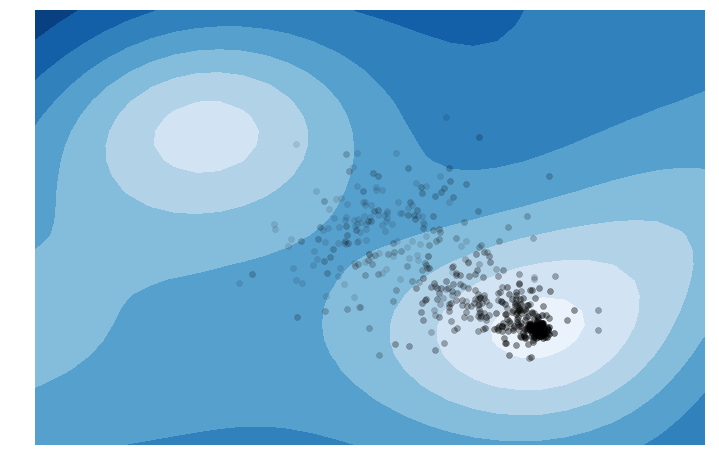
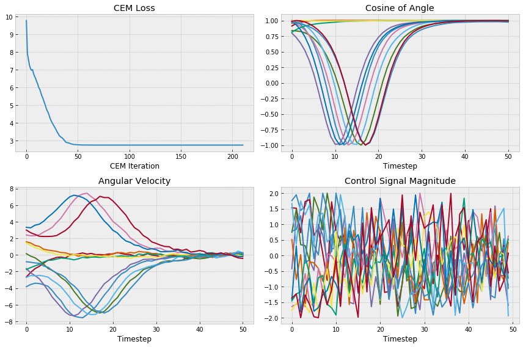
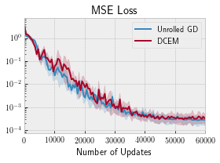
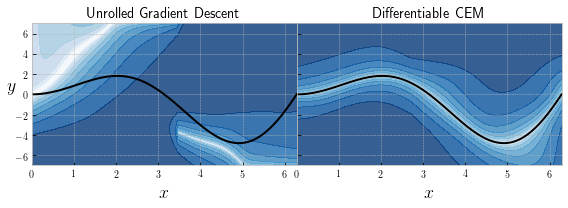
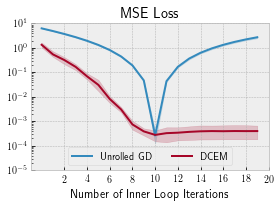
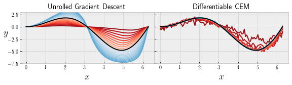
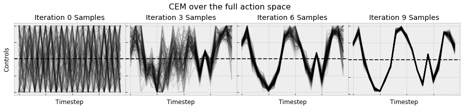
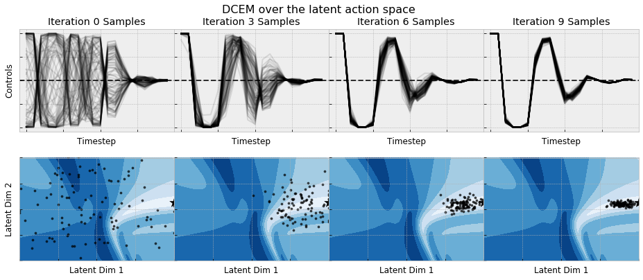

# The Differentiable Cross-Entropy Method

This repository is by
[Brandon Amos](http://bamos.github.io)
and
[Denis Yarats](https://cs.nyu.edu/~dy1042/)
and contains the PyTorch library and source code to reproduce the
experiments in our ICML 2020 paper on
[The Differentiable Cross-Entropy Method](https://arxiv.org/abs/1909.12830).
This repository depends on the
[Limited Multi-Label Projection Layer](https://github.com/locuslab/lml).
Our code provides an implementation of the vanilla
[cross-entropy method](http://web.mit.edu/6.454/www/www_fall_2003/gew/CEtutorial.pdf)
for optimization and our differentiable extension.
The core library source code is in
[dcem/](https://github.com/facebookresearch/dcem/tree/main/dcem);
our experiments are in
[exp/](https://github.com/facebookresearch/dcem/tree/main/exps),
including the [regression notebook](https://github.com/facebookresearch/dcem/blob/main/exps/regression-analysis.ipynb)
and the [action embedding notebook](https://github.com/facebookresearch/dcem/blob/main/exps/cartpole_emb-analysis.ipynb)
that produced most of the plots in our paper;
basic usage examples of our code that
are not published in our paper are in
[examples.ipynb](https://github.com/facebookresearch/dcem/blob/main/examples.ipynb);
our slides are available here in
[pptx](https://github.com/facebookresearch/dcem/blob/main/slides.pptx)
and
[pdf](https://github.com/facebookresearch/dcem/blob/main/slides.pdf)
formats;
and the full LaTeX source code for our paper is in
[paper/](https://github.com/facebookresearch/dcem/tree/main/paper).


# Setup

Once you have PyTorch setup, you can install our core code as
a package with pip:

```bash
pip install git+git://github.com/facebookresearch/dcem.git
```

This should automatically install the
[Limited Multi-Label Projection Layer](https://github.com/locuslab/lml)
dependency.

# Basic usage
Our core cross-entropy method implementation with the differentiable extension
is available in
[dcem](https://github.com/facebookresearch/dcem/blob/main/dcem/dcem.py).
We provide a lightweight wrapper for using CEM and DCEM in the control
setting in
[dcem_ctrl](https://github.com/facebookresearch/dcem/blob/main/dcem/dcem_ctrl.py).
These can be imported as:

```python
from dcem import dcem, dcem_ctrl
```

The interface for DCEM is:

```python
dcem(
    f, # Objective to optimize
    nx, # Number of dimensions to optimize over
    n_batch, # Number of elements in the batch
    init_mu, # Initial mean
    init_sigma, # Initial variance
    n_sample, # Number of samples CEM uses in each iteration
    n_elite, # Number of elite CEM candidates in each iteration
    n_iter, # Number of CEM iterations
    temp=1.0, # DCEM temperature parameter, set to None for vanilla CEM
    iter_cb, # Iteration callback
)
```

And our control interface is:
```python
dcem_ctrl(
    obs=obs, # Initial state
    plan_horizon, # Planning horizon for the control problem
    init_mu, # Initial control sequence mean, warm-starting can be done here
    init_sigma, # Initial variance around the control sequence
    n_sample, # Number of samples CEM uses in each iteration
    n_elite, # Number of elite CEM candidates in each iteration
    n_iter, # Number of CEM iterations
    n_ctrl, # Number of control dimensions
    lb, # Lower-bound of the control signal
    ub, # Upper-bound of the control signal
    temp=1.0, # DCEM temperature parameter, set to None for vanilla CEM
    rollout_cost, # Function that returns the cost of rollout out a control sequence
    iter_cb, # CEM iteration callback
)
```

## Simple examples
[examples.ipynb](https://github.com/facebookresearch/dcem/blob/main/examples.ipynb)
provides a light introduction for using our interface for
simple optimization and control problems.

### 2d optimization

We first show how to use DCEM to
optimize a 2-dimensional objective:



Next we *parameterize* that objective and show how DCEM
can update the objective to move the minimum to a
desired location:


### Pendulum control

We show how to use CEM to solve a pendulum control problem,
which can be made differentiable by setting a non-zero temperature
for the soft top-k operation.




# Reproducing our experimental results
We provide the source code for our cartpole and regression experiments
in the [exps](https://github.com/facebookresearch/dcem/tree/main/exps)
directory.
We do not have plans to open source our PlaNet and PPO experiment.
One starting point is to use an existing PyTorch PlaNet implementation
such as
[cross32768/PlaNet_PyTorch](https://github.com/cross32768/PlaNet_PyTorch)
with a PyTorch PPO implementation such as
[ikostrikov/pytorch-a2c-ppo-acktr-gai](https://github.com/ikostrikov/pytorch-a2c-ppo-acktr-gail)
or SAC implementation such as
[denisyarats/pytorch_sac](https://github.com/denisyarats/pytorch_sac).


## 1D energy-based regression
The base experimental code for our 1D energy-based regression experiment
is in
[regression.py](https://github.com/facebookresearch/dcem/blob/main/exps/regression.py).
Once running this, the results can be analyzed with
[regression-analysis.ipynb](https://github.com/facebookresearch/dcem/blob/main/exps/regression-analysis.ipynb),
which will produce:






## Embedding actions in the cartpole
The base experimental code for our cartpole action embedding
experiment is in
[cartpole_emb.py](https://github.com/facebookresearch/dcem/blob/main/exps/cartpole_emb.py).
Once running this, the results can be analyzed with
[cartpole_emb-analysis.ipynb](https://github.com/facebookresearch/dcem/blob/main/exps/cartpole_emb-analysis.ipynb),
which will produce:





# Citations
If you find this repository helpful in your publications,
please consider citing our paper.

```
@inproceedings{amos2020differentiable,
  title={{The Differentiable Cross-Entropy Method}},
  author={Brandon Amos and Denis Yarats},
  booktitle={ICML},
  year={2020}
}
```

# Licensing
This repository is licensed under the
[CC BY-NC 4.0 License](https://creativecommons.org/licenses/by-nc/4.0/).
