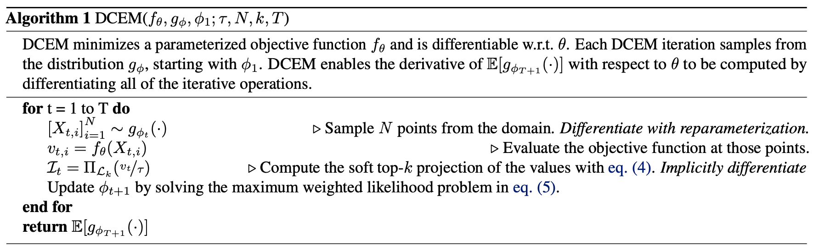

# The Differentiable Cross-Entropy Method

This repository is by
[Brandon Amos](http://bamos.github.io)
and
[Denis Yarats](https://cs.nyu.edu/~dy1042/)
and contains the PyTorch library and source code to reproduce the
experiments in our ICML 2020 paper on
[The Differentiable Cross-Entropy Method](https://arxiv.org/abs/1909.12830).
Our code provides an implementation of the vanilla
[cross-entropy method](http://web.mit.edu/6.454/www/www_fall_2003/gew/CEtutorial.pdf)
for optimization and our differentiable extension.



# Setup

Once you have PyTorch setup, you can install our core code as
a package with pip:

```bash
pip install git+git://github.com/facebookresearch/dcem.git
```

This should automatically install the
[Limited Multi-Label Projection Layer](https://github.com/locuslab/lml)
dependency.

# Basic usage
Our core cross-entropy method implementation with the differentiable extension
is available in
[dcem](https://github.com/facebookresearch/dcem/blob/main/dcem/dcem.py).
We provide a lightweight wrapper for using CEM and DCEM in the control
setting in
[dcem_ctrl](https://github.com/facebookresearch/dcem/blob/main/dcem/dcem_ctrl.py).
These can be imported as:

```python
from dcem import dcem, dcem_ctrl
```

The interface for DCEM is:

```python
dcem(
    f, # Objective to optimize
    nx, # Number of dimensions to optimize over
    n_batch, # Number of elements in the batch
    init_mu, # Initial mean
    init_sigma, # Initial variance
    n_sample, # Number of samples CEM uses in each iteration
    n_elite, # Number of elite CEM candidates in each iteration
    n_iter, # Number of CEM iterations
    temp=1.0, # DCEM temperature parameter, set to None for vanilla CEM
    iter_cb, # Iteration callback
)
```

And our control interface is:
```python
dcem_ctrl(
    obs=obs, # Initial state
    plan_horizon, # Planning horizon for the control problem
    init_mu, # Initial control sequence mean, warm-starting can be done here
    init_sigma, # Initial variance around the control sequence
    n_sample, # Number of samples CEM uses in each iteration
    n_elite, # Number of elite CEM candidates in each iteration
    n_iter, # Number of CEM iterations
    n_ctrl, # Number of control dimensions
    lb, # Lower-bound of the control signal
    ub, # Upper-bound of the control signal
    temp=1.0, # DCEM temperature parameter, set to None for vanilla CEM
    rollout_cost, # Function that returns the cost of rollout out a control sequence
    iter_cb, # CEM iteration callback
)
```

## Simple examples
[examples.ipynb](https://github.com/facebookresearch/dcem/blob/main/examples.ipynb)
provides a light introduction for using our interface for
simple optimization and control problems.


# Reproducing our regression and cartpole experiments
[cartpole_emb.py](https://github.com/facebookresearch/dcem/blob/main/exps/cartpole_emb.py)
[regression.py](https://github.com/facebookresearch/dcem/blob/main/exps/regression.py)

# Citations
If you find this repository helpful in your publications,
please consider citing our paper.

```
@inproceedings{amos2020differentiable,
  title={{The Differentiable Cross-Entropy Method}},
  author={Brandon Amos and Denis Yarats},
  booktitle={ICML},
  year={2020}
}
```

# Licensing
This repository is licensed under the
[CC BY-NC 4.0 License](https://creativecommons.org/licenses/by-nc/4.0/).
